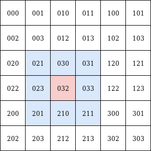
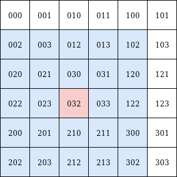
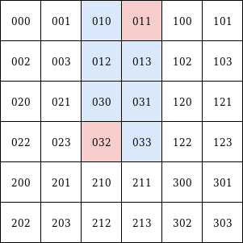

# Methods

## children
`children(self, at_level: int = -1) -> List['QuadKey']`

Get all children of the specified level. 

* `at_level` (default: 1): Level of the children keys to be returned. Has to be less than the current QuadKey's level.

**Example:**
```python
from pyquadkey2.quadkey import QuadKey
qk = QuadKey('0')
qk.children(at_level=2) # -> ['000', '001', '002', '003', '010', '011', '012', '013', '020', '021', '022', '023', '030', '031', '032', '033']
```

## parent
`parent(self) -> 'QuadKey'`

Get the immediate parent QuadKey.

## nearby
`nearby(self, n: int = 1) -> List[str]`

Get all QuadKeys at the same level that are in the current key's neighborhood of the specified radius `n`.

* `n` (default: 1): Rectangular "radius" to consider.

**Example:**

 

Left: `n=1`, right: `n=2`

```python
from pyquadkey2.quadkey import QuadKey
qk = QuadKey('032')
qk.nearby()     # -> ['021', '031', '023', '033', '201', '032', '030', '211', '210']
qk.nearby(n=2)  # -> ['023', '012', '022', '212', '210', '021', '033', '300', '203', '200', '030', '102', '003', '031', '302', '201', '032', '202', '120', '213', '002', '013', '122', '211', '020']
```

## is_ancestor
`is_ancestor(self, node: 'QuadKey')`

Whether or not the given key is an ancestor of the current one.

* `node`: The other QuadKey to check against


## is_descendent
`is_descendent(self, node: 'QuadKey')`

Whether or not the given key is a descendent of the current one.

* `node`: The other QuadKey to check against


## side
`side(self)`

Side length in meters of the current key's square projected onto a two-dimensional world map. 

## area
`area(self)`

Area in m² of the current key's square projected onto a two-dimensional world map. 

## difference
`difference(self, to: 'QuadKey') -> List['QuadKey']`

Returns all keys of the same level that are "between" (in two-dimensional space) the current key and a given one.

* `to`: The second QuadKey



```python
from pyquadkey2.quadkey import QuadKey
qk1 = QuadKey('032')
qk2 = QuadKey('011')
qk1.difference(qk1) # -> [011, 013, 031, 033, 010, 012, 030, 032]
```

## to_tile
`to_tile(self) -> Tuple[Tuple[int, int], int]`

Returns the current key as a tile-tuple and the corresponding level.

## to_pixel
`to_pixel(self, anchor: TileAnchor = TileAnchor.ANCHOR_NW) -> Tuple[int, int]`

Returns the current key as a pixel in a two-dimensional matrix.

* `anchor` (default: `TileAnchor.ANCHOR_NW`): "Corner" of the current QuadKey's square / tile to get the pixel value for. Choices are: `ANCHOR_NW`, `ANCHOR_SW`, `ANCHOR_NE`, `ANCHOR_SE`, `ANCHOR_CENTER`.

## to_geo
`to_geo(self, anchor: TileAnchor = TileAnchor.ANCHOR_NW) -> Tuple[float, float]`

Returns the current key as GPS coordinates.

* `anchor` (default: `TileAnchor.ANCHOR_NW`): "Corner" of the current QuadKey's square / tile to get the geo coordinate value for. Choices are: `ANCHOR_NW`, `ANCHOR_SW`, `ANCHOR_NE`, `ANCHOR_SE`, `ANCHOR_CENTER`.

## to_quadint
`to_quadint(self) -> int`

Returns the current key as 64-bit integer for better space efficiency.

* `anchor` (default: `TileAnchor.ANCHOR_NW`): "Corner" of the current QuadKey's square / tile to get the geo coordinate value for. Choices are: `ANCHOR_NW`, `ANCHOR_SW`, `ANCHOR_NE`, `ANCHOR_SE`, `ANCHOR_CENTER`.

## QuadKey.bbox (static)
`bbox(quadkeys: List['QuadKey']) -> List['QuadKey']`

Similar to [difference](#difference), but as a static method. In addition this method accepts multiple keys and returns all keys, that are contained in a bounding box spanned by the two outer-most `quadkeys`.

```python
from pyquadkey2.quadkey import QuadKey
qks = [QuadKey('032'), QuadKey('011')]
QuadKey.bbox(qks)  # -> [011, 013, 031, 033, 010, 012, 030, 032]
```  

## QuadKey.from_geo (static)
`from_geo(geo: Tuple[float, float], level: int) -> 'QuadKey'`

See [instantiation](instantiation.md#from-string-representation).

## QuadKey.from_str (static)
`from_str(qk_str: str) -> 'QuadKey'`

See [instantiation](instantiation.md#from-integer-representation).

## QuadKey.from_int (static)
`from_int(qk_int: int) -> 'QuadKey'`

See [instantiation](instantiation.md#from-coordinates).